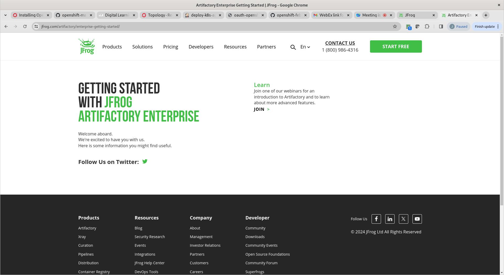
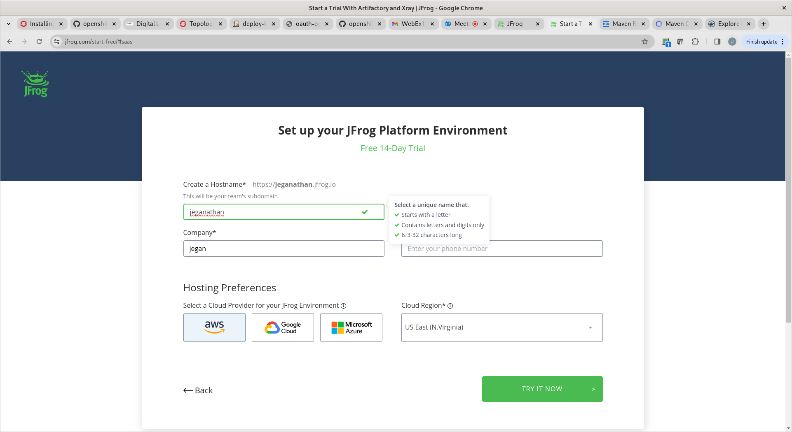

# Day 5

## References
About Parent Devfile
https://registry.devfile.io/viewer/devfiles/community/java-springboot?devfile-version=1.2.0

## Lab - Setup your own JFrog Artifactory Enterprise server 

On your Web browser, navigate to the below url
<pre>
https://jfrog.com/artifactory/enterprise-getting-started/
</pre>

Expected output

Click on "Start Free" button in the top right corner of the web page to get the below page

Click on Google to get the below page

Click on "Cloud Trial" and go with aws public cloud



## Lab - JFrog Private Docker Registry (Quick Test once you setup your JFrog Private Docker Registry)
```
docker login -ujegan@tektutor.org tektutor.jfrog.io
docker pull tektutor.jfrog.io/tektutor-docker/hello-world:latest
docker tag tektutor.jfrog.io/tektutor-docker/hello-world tektutor.jfrog.io/tektutor-docker/hello-world:1.0.0
docker push tektutor.jfrog.io/tektutor-docker/hello-world:1.0.0
```

Expected output
<pre>
[jegan@tektutor.org ~]$ docker login -ujegan@tektutor.org tektutor.jfrog.io
Password: 
WARNING! Your password will be stored unencrypted in /home/jegan/.docker/config.json.
Configure a credential helper to remove this warning. See
https://docs.docker.com/engine/reference/commandline/login/#credentials-store

Login Succeeded
  
[jegan@tektutor.org ~]$ sudo su jegan
[sudo] password for jegan: 
[jegan@tektutor.org ~]$ docker pull tektutor.jfrog.io/tektutor-docker/hello-world:latest
latest: Pulling from tektutor-docker/hello-world
c1ec31eb5944: Pull complete 
Digest: sha256:53641cd209a4fecfc68e21a99871ce8c6920b2e7502df0a20671c6fccc73a7c6
Status: Downloaded newer image for tektutor.jfrog.io/tektutor-docker/hello-world:latest
tektutor.jfrog.io/tektutor-docker/hello-world:latest
  
[jegan@tektutor.org ~]$ docker tag tektutor.jfrog.io/tektutor-docker/hello-world tektutor.jfrog.io/tektutor-docker/hello-world:1.0.0
  
[jegan@tektutor.org ~]$ docker push tektutor.jfrog.io/tektutor-docker/hello-world:1.0.0
The push refers to repository [tektutor.jfrog.io/tektutor-docker/hello-world]
ac28800ec8bb: Layer already exists 
1.0.0: digest: sha256:d37ada95d47ad12224c205a938129df7a3e52345828b4fa27b03a98825d1e2e7 size: 524  
</pre>

## Lab - Building a Custom Docker Image and pushing to JFrog Private Docker Registry
```
cd ~/openshift-march-2024
git pull
cd Day5/spring-ms
docker build -t tektutor/hello-microservice:1.0 .
docker images
```

Expected output
<pre>
[jegan@tektutor.org spring-ms]$ ls -l
total 8
-rw-r--r--. 1 jegan jegan  217 Mar 22 10:31 Dockerfile
-rw-r--r--. 1 jegan jegan 1715 Mar 21 19:44 pom.xml
drwxr-xr-x. 3 jegan jegan   18 Mar 21 19:44 src

    
[jegan@tektutor.org spring-ms]$ # Build custom docker image with sample spring boot microservice
[jegan@tektutor.org spring-ms]$ <b>docker build -t tektutor/hello-microservice:1.0 .</b>
[+] Building 2.3s (11/11) FINISHED                                                               docker:default
 => [internal] load build definition from Dockerfile                                                       0.0s
 => => transferring dockerfile: 315B                                                                       0.0s
 => [internal] load metadata for registry.access.redhat.com/ubi8/openjdk-11:latest                         0.8s
 => [internal] load metadata for docker.io/library/maven:3.6.3-jdk-11                                      2.2s
 => [internal] load .dockerignore                                                                          0.0s
 => => transferring context: 2B                                                                            0.0s
 => [stage-1 1/2] FROM registry.access.redhat.com/ubi8/openjdk-11:latest@sha256:285b35387bd04f93bb2ad8a2d  0.0s
 => [internal] load build context                                                                          0.0s
 => => transferring context: 1.25kB                                                                        0.0s
 => [stage1 1/3] FROM docker.io/library/maven:3.6.3-jdk-11@sha256:1d29ccf46ef2a5e64f7de3d79a63f9bcffb4dc5  0.0s
 => CACHED [stage1 2/3] COPY . .                                                                           0.0s
 => CACHED [stage1 3/3] RUN mvn clean package                                                              0.0s
 => CACHED [stage-1 2/2] COPY --from=stage1 target/*.jar app.jar                                           0.0s
 => exporting to image                                                                                     0.0s
 => => exporting layers                                                                                    0.0s
 => => writing image sha256:ec169bcd065873433a41201a6141821e8e155dfea95e9c291592fefb2732c2af               0.0s
 => => naming to docker.io/tektutor/hello-microservice:1.0     
  0.0s
  
[jegan@tektutor.org spring-ms]$ <b>docker images</b>
REPOSITORY                                      TAG       IMAGE ID       CREATED         SIZE
tektutor/hello-microservice                     1.0       ec169bcd0658   15 hours ago    410MB
tektutor.jfrog.io/tektutor-docker/hello-world   1.0.0     d2c94e258dcb   10 months ago   13.3kB
tektutor.jfrog.io/tektutor-docker/hello-world   latest    d2c94e258dcb   10 months ago   13.3kB
  
[jegan@tektutor.org spring-ms]$ <b>docker run -d --name hello --hostname hello -p 80:8080 tektutor/hello-microservice:1.0</b>
bc4bea9f0f746b490650d444842fde6d69c4f84132cbd2c8ed4d3171ff8ced69
  
[jegan@tektutor.org spring-ms]$ <b>docker ps</b>
CONTAINER ID   IMAGE                             COMMAND               CREATED        STATUS        PORTS                                                       NAMES
bc4bea9f0f74   tektutor/hello-microservice:1.0   "java -jar app.jar"   1 second ago   Up 1 second   8443/tcp, 8778/tcp, 0.0.0.0:80->8080/tcp, :::80->8080/tcp   hello
[jegan@tektutor.org spring-ms]$ curl localhost
</pre>


# Knative Serverless applications

## Info - What is OpenShiftServerless?
- Based on opensource knative project
- Deployment model for containers and functions that does resource allocation on demand
- Developers can focus on application development without needing to worry about infrastructe and deployment logistics
- Supports evern-driven architecture
- Can use any programming language or runtime
- Can run your application anywhere OpenShift runs
- Manage serverless applications natively within OpenShift

## Lab - Creating a knative service imperatively
```
kn service create --image=bitnami/nginx:latest
```

## Lab - Creating a knative service declaratively
```
apiVersion: serving.knative.dev/v1
kind: Service
metadata:
 name: frontend
spec:
  template:
    metadata:
      labels:
        app: guestbook
        tier: frontend
    spec:
      containers:
      - image: mgrimald/guestbook
        resources:
          requests:
             cpu: 100m
             memory: 100Mi
          env:
          - name: GET_HOSTS_FROM
            value: dns
          ports:
          - containerPort: 80
```
